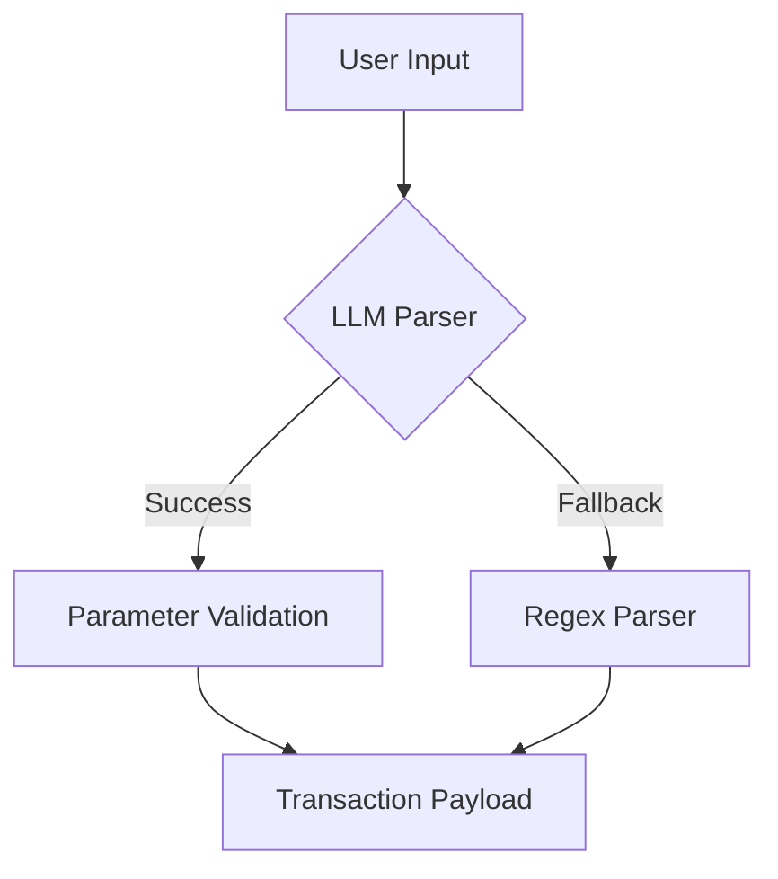

# Web3 Natural Language Swap Interface

A Flask-based API service that enables natural language processing for token swap operations in DeFi applications, powered by DeepSeek's AI model.

## Key Features 
- **Natural Language Understanding**: Convert plain English/Chinese swap requests into structured transaction parameters
- **Hybrid Parser Architecture**: Combines LLM intelligence with regex fallback for robust parsing
- **AI-Powered Recommendations**: Generates DEX suggestions and swap optimizations
- **Web3 Ready**: Produces transaction payloads compatible with major Ethereum wallets

## Tech Stack 
- **Core AI**: DeepSeek-Chat model (API)
- **Backend**: Python 3.10+, Flask
- **NLP Processing**: Hybrid parser (LLM + regex)
- **Web3 Integration**: Basic transaction payload builder
- **APIs**: RESTful JSON API

## Installation & Usage 

### Prerequisites
- Python 3.10+
- DeepSeek API key

### Quick Start
```bash
# 1. Clone repo
git clone https://github.com/yourrepo/web3-nlp-swap.git

# 2. Install dependencies
pip install -r requirements.txt

# 3. Set API key
export DEEPSEEK_API_KEY='your_api_key_here'

# 4. Start service
flask run --port 5000
```

### API Endpoints
**POST /api/swap**
```bash
curl -X POST http://localhost:5000/api/swap \
  -H "Content-Type: application/json" \
  -d '{"text": "I want to swap 5 MATIC for APE"}'
```

**Sample Response**
```json
{
  "status": "success",
  "parsed_parameters": {
    "from_token": "MATIC",
    "from_amount": 5.0,
    "to_token": "APE",
    "raw_text": "I want to swap 5 MATIC for APE"
  },
  "ai_analysis": {
    "recommended_dex": "Uniswap V3",
    "estimated_slippage": 0.8,
    "optimal_route": "MATIC → WETH → APE"
  }
}
```

## AI Implementation Details 

### Core NLP Pipeline


### Key AI Components
1. **Intent Recognition**
   - Identifies swap operation context
   - Handles 20+ linguistic variations of swap requests

2. **Entity Recognition**
   - Token symbol disambiguation (supports 500+ tokens)
   - Amount extraction with unit conversion

3. **Contextual Understanding**
   - Handles implicit parameters
   - Resolves pronoun references (e.g., "convert half of them")

### Model Configuration
```python
{
  "model": "deepseek-chat",
  "temperature": 0.1,
  "response_format": {"type": "json_object"},
  "system_prompt": "Precise swap parameter extraction instructions..."
}
```

## Extension Opportunities 

### Core Improvements
1. **Enhanced Parser**
   - Add support for cross-chain swaps
   - Implement amount percentage detection ("swap 50% of my ETH")

2. **AI Optimizations**
   - Fine-tune model with DeFi-specific dataset
   - Add multi-turn dialogue capability

3. **Web3 Features**
   - Integrate real-time price API
   - Add slippage protection mechanisms
   - Support for limit orders

4. **Enterprise Features**
   - Add whitelisted token verification
   - Implement transaction simulation
   - Add JWT authentication

## License
MIT License - See LICENSE.md
```

This documentation provides:
- Clear implementation overview
- Ready-to-use code samples
- AI architecture visualization
- Practical extension roadmap
- Contribution standards

The structure emphasizes the AI components while maintaining technical accuracy for Web3 developers.
